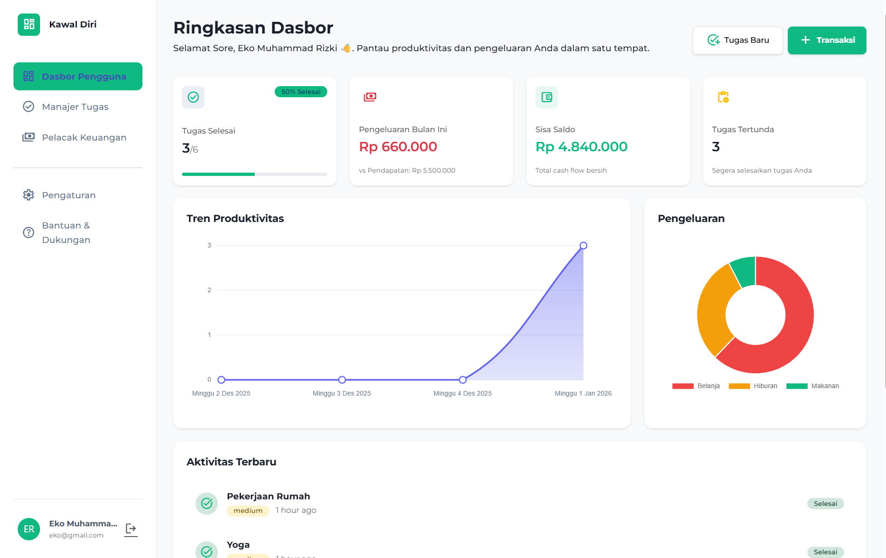

# KawalDiri - Life Manager Dashboard

**KawalDiri** adalah aplikasi manajemen produktivitas dan keuangan pribadi all-in-one yang dirancang untuk membantu pengguna mengelola aktivitas harian mereka dengan efisien. Dengan antarmuka yang modern, bersih, dan intuitif, KawalDiri memudahkan Anda untuk tetap terorganisir dan fokus pada tujuan Anda.

## 🌟 Fitur Utama

Aplikasi ini menawarkan berbagai fitur terintegrasi untuk mendukung gaya hidup produktif:

### 1. 📊 Dasbor Terpadu (Dashboard)
Pusat kontrol utama yang memberikan ringkasan visual tentang hari Anda:
*   **Ringkasan Cepat:** Lihat jumlah tugas selesai, pengeluaran hari ini, dan agenda berikutnya dalam satu pandangan.
*   **Visualisasi Data:** Grafik tren produktivitas dan pengeluaran mingguan.
*   **Aktivitas Terbaru:** Log aktivitas real-time untuk memantau apa yang baru saja terjadi.
*   **Navigasi Cepat:** Akses mudah ke semua modul utama.

### 2. ✅ Manajer Tugas (Task Manager)
Kelola to-do list dan proyek Anda dengan mudah:
*   **Manajemen Tugas:** Tambah, edit, dan hapus tugas dengan detail prioritas (Tinggi, Sedang, Rendah).
*   **Filter Cerdas:** Pisahkan tugas antara "Tertunda" dan "Selesai" untuk fokus yang lebih baik.
*   **Indikator Status:** Penanda visual yang jelas untuk tenggat waktu (Hari Ini, Besok, Kemarin).

### 3. 💰 Pelacak Keuangan (Financial Tracker)
Kendalikan arus kas pribadi Anda:
*   **Ringkasan Saldo:** Monitor total saldo, pendapatan, dan pengeluaran bulanan.
*   **Grafik Anggaran:** Visualisasi sisa anggaran dengan diagram lingkaran yang intuitif.
*   **Riwayat Transaksi:** Catat dan kategorikan setiap pemasukan dan pengeluaran (Makanan, Transportasi, Gaji, dll).

### 4. ⚙️ Pengaturan & Personalisasi
Sesuaikan aplikasi dengan preferensi Anda:
*   **Profil Pengguna:** Kelola informasi akun, foto profil, dan detail kontak.
*   **Tema UI:** Pilih antara Mode Terang (Light), Mode Gelap (Dark), atau sesuaikan dengan sistem perangkat Anda.
*   **Keamanan:** Fitur ganti kata sandi dan pengaturan notifikasi (Email/Push).

### 5. ❓ Bantuan & Dukungan
Pusat bantuan mandiri dan layanan pelanggan:
*   **Pencarian Bantuan:** Temukan jawaban dengan cepat melalui kolom pencarian.
*   **FAQ Interaktif:** Pertanyaan umum yang sering diajukan dalam format accordion.
*   **Kontak Langsung:** Opsi untuk Chat Langsung atau Kirim Email ke tim dukungan.

## 🛠️ Teknologi yang Digunakan

Aplikasi ini dibangun menggunakan teknologi web modern yang handal:

*   **Backend:** [Laravel](https://laravel.com/) (PHP Framework)
*   **Frontend:** [Bootstrap 5](https://getbootstrap.com/) (CSS Framework)
*   **Compiling:** [Vite](https://vitejs.dev/)
*   **Styling:** Custom CSS (Tema Indigo & Emerald)
*   **Icons:** [Google Material Symbols](https://fonts.google.com/icons)
*   **Fonts:** [Montserrat](https://fonts.google.com/specimen/Montserrat) (Google Fonts)
*   **Alerts:** [SweetAlert2](https://sweetalert2.github.io/)

## 🚀 Cara Menjalankan

1.  Pastikan PHP dan Composer sudah terinstal.
2.  Clone repositori ini.
3.  Jalankan `composer install` untuk menginstal dependensi backend.
4.  Jalankan `npm install` && `npm run dev` untuk mengompilasi aset frontend.
5.  Salin file `.env.example` ke `.env` dan konfigurasi database.
6.  Jalankan `php artisan migrate` untuk membuat tabel database.
7.  Jalankan `php artisan serve` untuk memulai server lokal.
8.  Buka `http://127.0.0.1:8000` di browser Anda.

## 📝 Catatan Pembaruan (Terbaru)

### Update: Modernisasi UI & Perbaikan Bug
*   **Fix Bug:** Memperbaiki masalah layar yang semakin gelap (backdrop stacking) saat membuka modal berulang kali dengan menonaktifkan re-inisialisasi script Bootstrap/SweetAlert oleh Swup.js.
*   **Redesign Modal:** Mengubah tampilan modal "Tugas Baru" dan "Transaksi Baru" menjadi lebih modern, bersih, dan premium.
    *   Implementasi *Soft Inputs* dan *Segmented Controls* (Tab Pilihan).
    *   Input mata uang yang lebih besar dan jelas.
*   **Filter Tugas:** Menambahkan fitur tab "Semua", "Tertunda", dan "Selesai" pada halaman Manajer Tugas yang berfungsi penuh.
*   **Dokumentasi:** Penambahan komentar kode (Bahasa Indonesia) untuk memudahkan pengembangan selanjutnya.

---
Dikembangkan dengan ❤️ oleh Tim KawalDiri.
