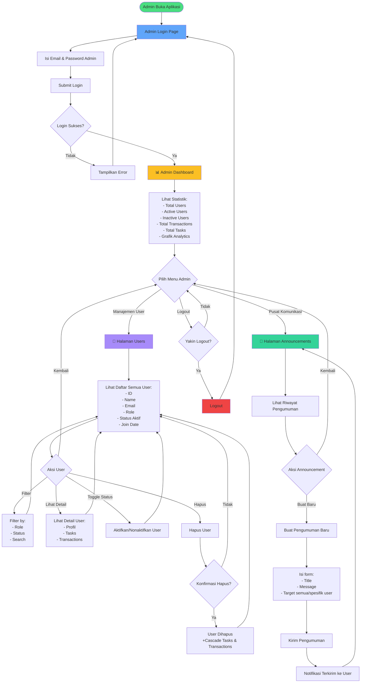
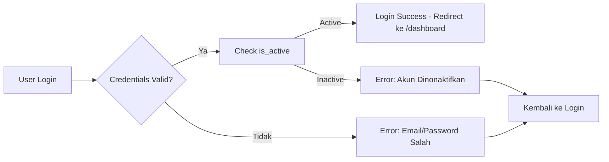
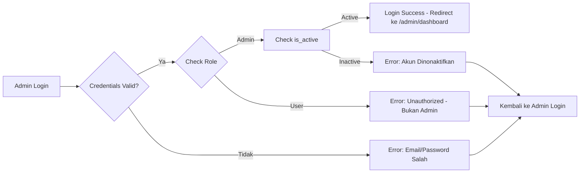
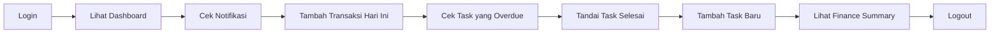
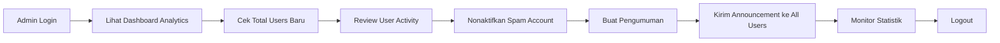

# Flowchart Aplikasi KawalDiri

Dokumentasi alur penggunaan aplikasi KawalDiri untuk **User** dan **Admin**, mencakup semua fitur utama dari login hingga logout.

---

## 📋 Daftar Isi

1. [Overview Aplikasi](#-overview-aplikasi)
2. [Flowchart User](#-flowchart-user)
3. [Flowchart Admin](#-flowchart-admin)
4. [Detail Fitur User](#-detail-fitur-user)
5. [Detail Fitur Admin](#-detail-fitur-admin)

---

## 🎯 Overview Aplikasi

**KawalDiri** adalah aplikasi manajemen produktivitas dan keuangan pribadi yang memiliki 2 jenis pengguna:

- **👤 User (Pengguna Biasa)**: Mengelola tugas, keuangan, dan pengaturan pribadi
- **👨‍💼 Admin**: Mengelola pengguna, dashboard analytics, dan siaran pengumuman

---

## 👤 Flowchart User

```mermaid
flowchart TD
    Start([Buka Aplikasi]) --> Landing[Landing Page]
    Landing --> HasAccount{Sudah punya akun?}
    
    %% Registration Flow
    HasAccount -->|Belum| Register[Register]
    Register --> FillRegister[Isi form:<br/>- Name<br/>- Email<br/>- Password]
    FillRegister --> RegisterSubmit[Submit Register]
    RegisterSubmit --> RegisterSuccess{Sukses?}
    RegisterSuccess -->|Ya| LoginPage
    RegisterSuccess -->|Tidak| RegisterError[Tampilkan Error]
    RegisterError --> Register
    
    %% Login Flow
    HasAccount -->|Sudah| Login[Login]
    Login --> LoginPage[Halaman Login]
    LoginPage --> FillLogin[Isi Email & Password]
    FillLogin --> LoginSubmit[Submit Login]
    LoginSubmit --> LoginSuccess{Sukses?}
    LoginSuccess -->|Tidak| LoginError[Tampilkan Error]
    LoginError --> ForgotPassword{Lupa Password?}
    ForgotPassword -->|Ya| ResetPasswordFlow[Reset Password]
    ForgotPassword -->|Tidak| LoginPage
    
    ResetPasswordFlow --> EnterEmail[Masukkan Email]
    EnterEmail --> SendResetLink[Kirim Link Reset]
    SendResetLink --> CheckEmail[Cek Email]
    CheckEmail --> ClickResetLink[Klik Link di Email]
    ClickResetLink --> NewPassword[Masukkan Password Baru]
    NewPassword --> PasswordReset[Password Berhasil Direset]
    PasswordReset --> LoginPage
    
    %% Main Dashboard
    LoginSuccess -->|Ya| Dashboard[📊 Dashboard]
    Dashboard --> DashboardView[Lihat Ringkasan:<br/>- Total Income/Expense<br/>- Saldo<br/>- Tugas Pending<br/>- Grafik Produktivitas]
    
    %% Main Menu
    DashboardView --> MainMenu{Pilih Menu}
    
    %% Tasks Flow
    MainMenu -->|Manajer Tugas| Tasks[✅ Halaman Tasks]
    Tasks --> TaskActions{Aksi Task}
    TaskActions -->|Tambah| AddTask[Buat Task Baru]
    AddTask --> FillTask[Isi form:<br/>- Title<br/>- Description<br/>- Priority<br/>- Due Date]
    FillTask --> SaveTask[Simpan Task]
    SaveTask --> Tasks
    
    TaskActions -->|Edit| EditTask[Edit Task]
    EditTask --> UpdateTask[Update Task]
    UpdateTask --> Tasks
    
    TaskActions -->|Selesai| CompleteTask[Tandai Selesai]
    CompleteTask --> Tasks
    
    TaskActions -->|Hapus| DeleteTask[Hapus Task]
    DeleteTask --> Tasks
    
    TaskActions -->|Kembali| MainMenu
    
    %% Finance Flow
    MainMenu -->|Pelacak Keuangan| Finance[💰 Halaman Finance]
    Finance --> FinanceView[Lihat:<br/>- Total Income<br/>- Total Expense<br/>- Saldo<br/>- Budget Progress<br/>- Riwayat Transaksi]
    FinanceView --> FinanceActions{Aksi Finance}
    
    FinanceActions -->|Tambah| AddTransaction[Tambah Transaksi]
    AddTransaction --> FillTransaction[Isi form:<br/>- Title<br/>- Category<br/>- Type Income/Expense<br/>- Amount<br/>- Date]
    FillTransaction --> SaveTransaction[Simpan Transaksi]
    SaveTransaction --> Finance
    
    FinanceActions -->|Edit| EditTransaction[Edit Transaksi]
    EditTransaction --> UpdateTransaction[Update Transaksi]
    UpdateTransaction --> Finance
    
    FinanceActions -->|Hapus| DeleteTransaction[Hapus Transaksi]
    DeleteTransaction --> Finance
    
    FinanceActions -->|Kembali| MainMenu
    
    %% Settings Flow
    MainMenu -->|Pengaturan| Settings[⚙️ Halaman Settings]
    Settings --> SettingsMenu{Pilih Pengaturan}
    
    SettingsMenu -->|Profil| ProfileSettings[Pengaturan Profil]
    ProfileSettings --> EditProfile[Edit:<br/>- Name<br/>- Username<br/>- Email<br/>- Phone]
    EditProfile --> SaveProfile[Simpan Profil]
    SaveProfile --> Settings
    
    SettingsMenu -->|Avatar| AvatarSettings[Ganti Avatar]
    AvatarSettings --> ChooseAvatar[Pilih Avatar 1-8]
    ChooseAvatar --> SaveAvatar[Simpan Avatar]
    SaveAvatar --> Settings
    
    SettingsMenu -->|Password| PasswordSettings[Ganti Password]
    PasswordSettings --> EnterOldPassword[Isi:<br/>- Password Lama<br/>- Password Baru<br/>- Konfirmasi]
    EnterOldPassword --> SavePassword[Simpan Password]
    SavePassword --> Settings
    
    SettingsMenu -->|Preferensi| PreferenceSettings[Pengaturan Tampilan]
    PreferenceSettings --> EditPreference[Edit:<br/>- Theme light/dark/system<br/>- Accent Color]
    EditPreference --> SavePreference[Simpan Preferensi]
    SavePreference --> Settings
    
    SettingsMenu -->|Notifikasi| NotificationSettings[Pengaturan Notifikasi]
    NotificationSettings --> EditNotif[Toggle:<br/>- Email Notifications<br/>- Weekly Reports]
    EditNotif --> SaveNotif[Simpan Notifikasi]
    SaveNotif --> Settings
    
    SettingsMenu -->|Budget| BudgetSettings[Pengaturan Budget]
    BudgetSettings --> SetBudget[Set Budget Bulanan]
    SetBudget --> SaveBudget[Simpan Budget]
    SaveBudget --> Settings
    
    SettingsMenu -->|Reset| ResetSettings[Reset Dashboard]
    ResetSettings --> ConfirmReset{Konfirmasi Reset?}
    ConfirmReset -->|Ya| DoReset[Reset Data Dashboard]
    DoReset --> Settings
    ConfirmReset -->|Tidak| Settings
    
    SettingsMenu -->|Kembali| MainMenu
    
    %% Help Flow
    MainMenu -->|Bantuan| Help[❓ Halaman Help]
    Help --> HelpActions{Aksi Help}
    HelpActions -->|Lihat FAQ| ViewFAQ[Lihat FAQ]
    ViewFAQ --> Help
    
    HelpActions -->|Search| SearchFAQ[Cari di FAQ]
    SearchFAQ --> Help
    
    HelpActions -->|Kontak| ContactSupport[Kirim Pesan ke Admin]
    ContactSupport --> FillMessage[Isi:<br/>- Subject<br/>- Message]
    FillMessage --> SendMessage[Kirim Pesan]
    SendMessage --> Help
    
    HelpActions -->|Kembali| MainMenu
    
    %% Notifications
    MainMenu -->|Notifikasi| Notifications[🔔 Notifikasi]
    Notifications --> ViewNotif[Lihat Notifikasi]
    ViewNotif --> NotifActions{Aksi Notifikasi}
    NotifActions -->|Tandai Dibaca| MarkRead[Tandai Sudah Dibaca]
    MarkRead --> Notifications
    
    NotifActions -->|Hapus| DeleteNotif[Hapus Notifikasi]
    DeleteNotif --> Notifications
    
    NotifActions -->|Kembali| MainMenu
    
    %% Logout
    MainMenu -->|Logout| LogoutConfirm{Yakin Logout?}
    LogoutConfirm -->|Ya| Logout[Logout]
    Logout --> Landing
    LogoutConfirm -->|Tidak| MainMenu
    
    style Start fill:#4ade80
    style Landing fill:#60a5fa
    style Dashboard fill:#fbbf24
    style Tasks fill:#a78bfa
    style Finance fill:#34d399
    style Settings fill:#f472b6
    style Help fill:#fb923c
    style Logout fill:#ef4444
```



---

## 👨‍💼 Flowchart Admin



---

## 📝 Detail Fitur User

### 1. **Dashboard** 📊

**Halaman**: `/dashboard`

**Fungsi**: Menampilkan ringkasan aktivitas dan keuangan pengguna

**Fitur**:
- 📈 **Grafik Produktivitas**: Visualisasi tugas yang selesai per hari
- 💰 **Ringkasan Keuangan Bulan Ini**:
  - Total Income (pemasukan)
  - Total Expense (pengeluaran)
  - Saldo (income - expense)
  - Budget progress bar
- ✅ **Tugas Pending**: Daftar tugas yang belum selesai
- 📊 **Grafik Pengeluaran per Kategori**
- 🔔 **Notifikasi terbaru**
- 📅 **Aktivitas terakhir**

**API Endpoint**:
- `GET /api/dashboard/productivity` - Data grafik produktivitas
- `GET /api/dashboard/expenses` - Data pengeluaran per kategori
- `GET /api/dashboard/activities` - Aktivitas terakhir

---

### 2. **Manajer Tugas** ✅

**Halaman**: `/tasks`

**Fungsi**: Mengelola to-do list / tugas harian

**Fitur**:
- ➕ **Tambah Task**: Buat tugas baru
- ✏️ **Edit Task**: Ubah detail tugas
- ✅ **Tandai Selesai**: Ubah status task jadi completed
- 🗑️ **Hapus Task**: Hapus tugas
- 🔍 **Filter**: 
  - Berdasarkan status (pending/completed)
  - Berdasarkan prioritas (low/medium/high)
  - Berdasarkan tanggal
- 📋 **Lihat Detail**: Deskripsi lengkap tugas

**Form Input**:
- Title (wajib)
- Description (opsional)
- Priority: Low / Medium / High
- Due Date (tanggal deadline)
- Status: Pending / Completed

---

### 3. **Pelacak Keuangan** 💰

**Halaman**: `/finance`

**Fungsi**: Mencatat dan memantau keuangan pribadi

**Fitur**:
- ➕ **Tambah Transaksi**: Catat pemasukan/pengeluaran
- ✏️ **Edit Transaksi**: Ubah detail transaksi
- 🗑️ **Hapus Transaksi**: Hapus catatan transaksi
- 📊 **Ringkasan Keuangan**:
  - Total income bulan ini
  - Total expense bulan ini
  - Saldo
  - Budget progress
- 📈 **Grafik Pengeluaran per Kategori**
- 📅 **Riwayat Transaksi**: List semua transaksi dengan filter
- 🔍 **Filter**:
  - Berdasarkan tipe (income/expense)
  - Berdasarkan kategori
  - Berdasarkan tanggal
  - Berdasarkan status (paid/pending)

**Form Input**:
- Title (wajib) - contoh: "Makan Siang"
- Category (wajib) - contoh: "Makanan", "Transport", "Gaji"
- Type: Income / Expense
- Amount (wajib) - nominal dalam Rupiah
- Date (wajib)
- Status: Paid / Pending

**Kategori Umum**:
- 🍔 Makanan
- 🚗 Transport
- 💼 Gaji
- 🛍️ Belanja
- 🎮 Hiburan
- 💊 Kesehatan
- 📚 Pendidikan
- 🏠 Rumah Tangga
- 📱 Teknologi
- 💸 Lainnya

---

### 4. **Pengaturan** ⚙️

**Halaman**: `/settings`

**Fungsi**: Konfigurasi profil dan preferensi aplikasi

**Sub-menu**:

#### a. **Profil**
- Ubah Name, Username, Email, Phone
- Upload/pilih Avatar (1-8)

#### b. **Keamanan**
- Ganti Password

#### c. **Preferensi Tampilan**
- Theme: Light / Dark / System
- Accent Color: Pilih warna tema dashboard

#### d. **Notifikasi**
- Toggle Email Notifications
- Toggle Weekly Reports

#### e. **Budget**
- Set budget bulanan untuk tracking pengeluaran

#### f. **Reset Dashboard**
- Reset semua data dashboard ke default

---

### 5. **Bantuan & Dukungan** ❓

**Halaman**: `/help`

**Fungsi**: Pusat bantuan dan FAQ

**Fitur**:
- 📖 **FAQ**: Pertanyaan yang sering diajukan
  - Cara menggunakan fitur
  - Tips produktivitas
  - Troubleshooting
- 🔍 **Search FAQ**: Cari di knowledge base
- 📧 **Kontak Support**: Kirim pesan ke admin
  - Subject
  - Message
- 📚 **Panduan Pengguna**: Tutorial lengkap

---

### 6. **Notifikasi** 🔔

**Fungsi**: Menerima pemberitahuan dari sistem

**Jenis Notifikasi**:
- 📢 Pengumuman dari admin
- ⏰ Reminder tugas mendekati deadline
- ⚠️ Tugas yang overdue
- 💰 Budget warning (pengeluaran mendekati budget)
- ✅ Task completion confirmation

**Aksi**:
- Tandai sebagai sudah dibaca
- Hapus notifikasi
- Filter read/unread

---

## 🛠️ Detail Fitur Admin

### 1. **Admin Dashboard** 📊

**Halaman**: `/admin/dashboard`

**Fungsi**: Monitoring dan analytics seluruh sistem

**Statistik yang Ditampilkan**:
- 👥 **Total Users**: Jumlah semua pengguna terdaftar
- ✅ **Active Users**: Pengguna dengan status aktif
- ❌ **Inactive Users**: Pengguna yang dinonaktifkan
- 💰 **Total Transactions**: Jumlah semua transaksi sistem
- ✅ **Total Tasks**: Jumlah semua tugas sistem
- 📈 **Grafik Pertumbuhan User**: Per bulan
- 📊 **Grafik Aktivitas User**: Login activity
- 📅 **Recent User Registrations**: 10 user terbaru

**Insight Analytics**:
- User paling aktif
- Total transaksi value
- Total task completion rate
- User growth trend

---

### 2. **Manajemen User** 👥

**Halaman**: `/admin/users`

**Fungsi**: Mengelola semua pengguna aplikasi

**Fitur**:
- 📋 **Tabel User**: Tampilkan semua user dengan info:
  - ID
  - Name
  - Email
  - Role (User/Admin)
  - Status (Active/Inactive)
  - Tanggal Join
  - Jumlah Tasks
  - Jumlah Transactions
- 🔍 **Search**: Cari user berdasarkan nama/email
- 🎛️ **Filter**:
  - Role (User/Admin)
  - Status (Active/Inactive)
  - Join date range
- 👁️ **View Detail**: Lihat profil lengkap user
  - Informasi pribadi
  - Daftar tasks
  - Daftar transactions
  - Activity log
- 🔄 **Toggle Status**: Aktifkan/nonaktifkan user
  - User inactive tidak bisa login
  - Data tetap tersimpan
- 🗑️ **Delete User**: Hapus user permanen
  - ⚠️ CASCADE: Semua tasks dan transactions user ikut terhapus
  - Memerlukan konfirmasi
- 📊 **Export**: Export data user ke CSV/Excel (opsional)

**Actions**:
```
POST /admin/users/{id}/toggle-status - Toggle status aktif/nonaktif
DELETE /admin/users/{id} - Hapus user (cascade delete)
```

---

### 3. **Pusat Komunikasi (Announcements)** 📢

**Halaman**: `/admin/announcements`

**Fungsi**: Mengirim pengumuman/broadcast ke user

**Fitur**:
- 📝 **Buat Pengumuman**: Form untuk membuat announcement
  - Title
  - Message (rich text)
  - Target: Semua user / Pilih user spesifik
  - Priority: Info / Warning / Important
- 📋 **Riwayat Pengumuman**: List semua announcement yang pernah dikirim
  - Title
  - Tanggal kirim
  - Jumlah penerima
  - Status read/unread
- 🔔 **Send Notification**: Kirim notifikasi real-time ke user
  - Muncul di notification bell user
  - Email notification (jika diaktifkan user)

**Cara Kerja**:
1. Admin buat pengumuman
2. Sistem kirim notifikasi ke semua user (atau target spesifik)
3. User menerima notifikasi di dashboard
4. User bisa baca dan tandai sebagai dibaca

---

## 🔐 Sistem Autentikasi

### User Authentication



### Admin Authentication



**Middleware**:
- `auth`: Memastikan user sudah login
- `isAdmin`: Memastikan user memiliki role 'admin'

---

## 🚀 User Journey Map

### Skenario 1: User Baru Pertama Kali

```mermaid
flowchart LR
    A[Buka Aplikasi] --> B[Landing Page]
    B --> C[Klik Register]
    C --> D[Isi Form Register]
    D --> E[Submit]
    E --> F[Login dengan Akun Baru]
    F --> G[Dashboard Pertama Kali]
    G --> H[Onboarding Tour - Opsional]
    H --> I[Set Budget di Settings]
    I --> J[Tambah Task Pertama]
    J --> K[Tambah Transaksi Pertama]
    K --> L[Lihat Dashboard Terupdate]
```



### Skenario 2: User Harian (Daily Use)



### Skenario 3: Admin Monitoring



---

## 📱 Responsive Behavior

Aplikasi KawalDiri dirancang untuk bekerja di berbagai perangkat:

- **Desktop** (>1024px): Full layout dengan sidebar
- **Tablet** (768px - 1024px): Collapsible sidebar
- **Mobile** (<768px): Hamburger menu, stack layout

---

## 🔔 Sistem Notifikasi

### Trigger Notifikasi User

| Event | Trigger | Notifikasi |
|-------|---------|------------|
| **Task Overdue** | Saat due_date terlewati dan status pending | "⚠️ Tugas '[title]' sudah melewati deadline!" |
| **Budget Warning** | Expense mencapai 80% budget | "💰 Pengeluaran kamu sudah 80% dari budget bulanan!" |
| **Budget Exceeded** | Expense melebihi budget | "🚨 Pengeluaran kamu melebihi budget bulanan!" |
| **Task Reminder** | 1 hari sebelum due_date | "⏰ Tugas '[title]' jatuh tempo besok!" |
| **Admin Announcement** | Admin kirim pengumuman | "📢 Pengumuman: [title]" |
| **Welcome** | Setelah registrasi | "👋 Selamat datang di KawalDiri!" |

### Notifikasi Admin

| Event | Trigger | Notifikasi |
|-------|---------|------------|
| **New User** | User baru register | "👤 User baru terdaftar: [name]" |
| **User Report** | User kirim pesan via Help Center | "📧 Pesan baru dari user: [subject]" |

---

## 🎨 Color Coding Dashboard

User dapat mengatur **Accent Color** di settings untuk personalisasi:

- Default: `#6366f1` (Indigo)
- Pilihan lain: Red, Orange, Yellow, Green, Blue, Purple, Pink

---

## 💾 Data Persistence

Semua data disimpan di database MySQL/PostgreSQL:

- **Users**: Profil, preferensi, budget
- **Tasks**: To-do list dengan status dan priority
- **Transactions**: Catatan keuangan income/expense
- **Notifications**: Notifikasi sistem

**Cascade Delete**: Jika user dihapus, semua tasks dan transactions-nya ikut terhapus.

---

## 🔒 Security Features

1. **Password Hashing**: Menggunakan bcrypt
2. **CSRF Protection**: Token CSRF di semua form
3. **Middleware Auth**: Proteksi route yang memerlukan login
4. **Admin Authorization**: Middleware khusus untuk admin
5. **Mass Assignment Protection**: Fillable attributes di model
6. **SQL Injection Prevention**: Eloquent ORM
7. **XSS Protection**: Blade template escaping

---

## 📊 Kesimpulan

### User Flow Summary:
1. **Register/Login** → Autentikasi
2. **Dashboard** → Lihat ringkasan
3. **Tasks** → Kelola produktivitas
4. **Finance** → Kelola keuangan
5. **Settings** → Kustomisasi aplikasi
6. **Help** → Bantuan dan support

### Admin Flow Summary:
1. **Login** → Autentikasi admin
2. **Dashboard** → Monitoring analytics
3. **User Management** → Kelola pengguna
4. **Announcements** → Broadcast ke user

---

**KawalDiri** membantu user mengontrol produktivitas dan keuangan dengan interface yang intuitif dan fitur yang lengkap! 🚀
