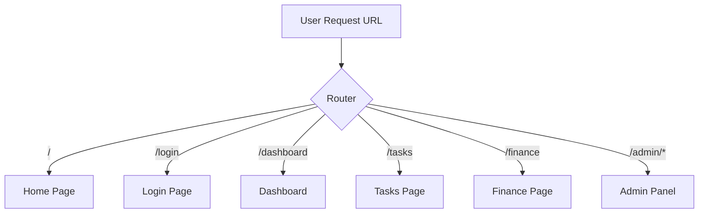
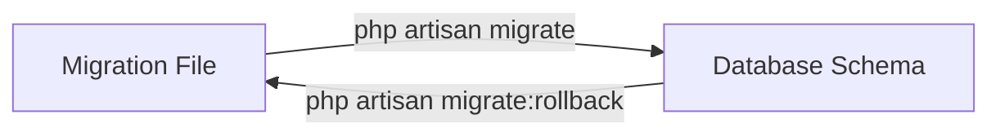
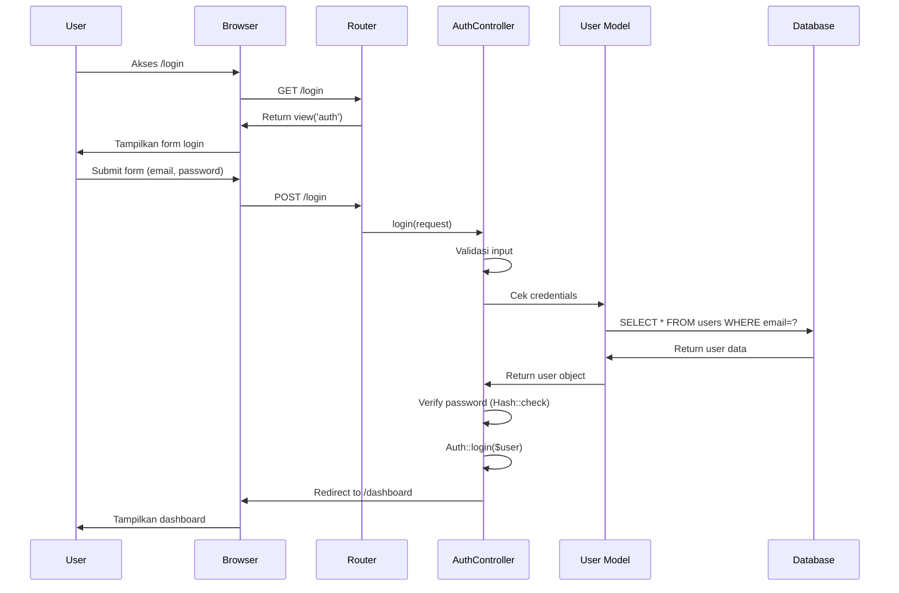
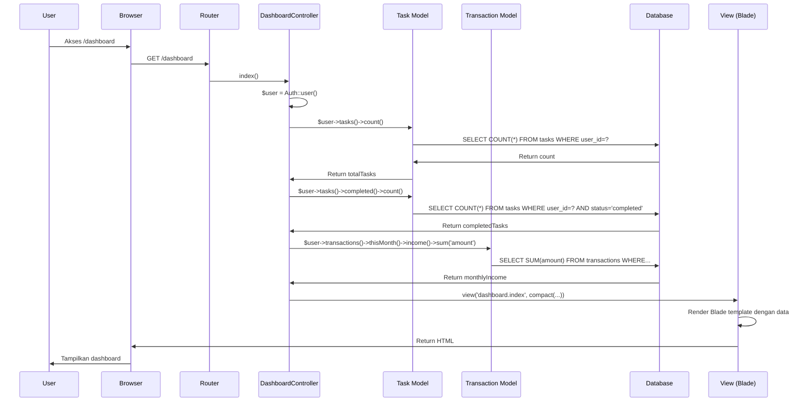
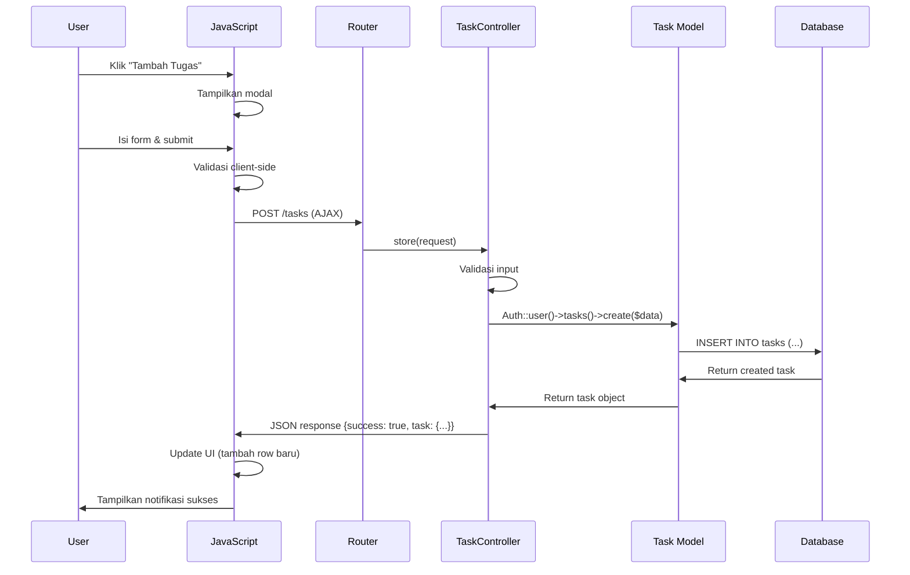
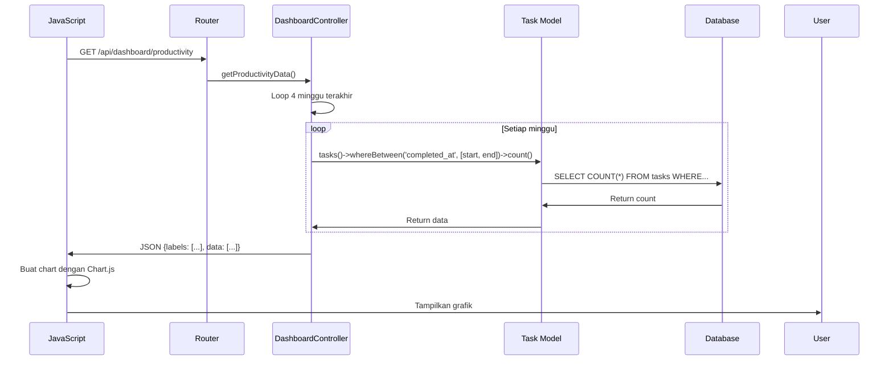

# Dokumentasi Pitching - Aplikasi Kawal Diri

##  Daftar Isi

1. [Pengenalan Arsitektur](#-pengenalan-arsitektur)
2. [Struktur Folder](#-struktur-folder)
3. [Model-View-Controller (MVC)](#-model-view-controller-mvc)
4. [Routing System](#-routing-system)
5. [Database Migration](#-database-migration)
6. [Database Seeder](#-database-seeder)
7. [Template Engine (Blade)](#-template-engine-blade)
8. [Alur Kerja Aplikasi](#-alur-kerja-aplikasi)
9. [Middleware & Security](#-middleware--security)
10. [API Endpoints](#-api-endpoints)


## Pengenalan Arsitektur

**Kawal Diri** adalah aplikasi web berbasis **Laravel Framework** yang mengadopsi pola arsitektur **MVC (Model-View-Controller)** untuk memisahkan logic bisnis, tampilan, dan alur data secara terstruktur.

### Tech Stack
- **Framework**: Laravel 12.44.0
- **PHP Version**: 8.2+
- **Database**: MySQL (via XAMPP)
- **Frontend**: Bootstrap 5.3, Blade Template Engine
- **JavaScript Libraries**: 
  - Chart.js (untuk grafik)
  - SweetAlert2 (untuk validasi)

### Fitur Utama
✅ Manajemen Tugas (To-Do List)  
✅ Pelacak Keuangan (Finance Tracker)  
✅ Dashboard Analytics dengan Grafik  
✅ Admin Panel untuk Pengelolaan User  
✅ Sistem Notifikasi Real-time  
✅ Dark Mode & Theme Customization  
✅ Password Reset

---

## Struktur Folder

Struktur folder Laravel mengikuti konvensi standar dengan beberapa kustomisasi untuk kebutuhan aplikasi:

```
KawalDiri/
├── app/                        # Kode aplikasi utama
│   ├── Http/
│   │   ├── Controllers/        # Controllers (logika bisnis)
│   │   │   ├── Admin/          # Controllers khusus Admin
│   │   │   │   ├── AuthController.php
│   │   │   │   ├── DashboardController.php
│   │   │   │   ├── UserController.php
│   │   │   │   └── AnnouncementController.php
│   │   │   ├── AuthController.php
│   │   │   ├── DashboardController.php
│   │   │   ├── TaskController.php
│   │   │   ├── TransactionController.php
│   │   │   ├── SettingsController.php
│   │   │   ├── HelpController.php
│   │   │   ├── NotificationController.php
│   │   │   └── LupaSandiController.php
│   │   └── Middleware/         # Middleware (filter request)
│   │       └── IsAdmin.php     # Validasi akses admin
│   ├── Models/                 # Models (representasi tabel database)
│   │   ├── User.php
│   │   ├── Task.php
│   │   └── Transaction.php
│   ├── Notifications/          # Notifikasi Email/Push
│   │   └── AnnouncementNotification.php
│   └── Providers/              # Service Providers
│       └── AppServiceProvider.php
│
├── database/                   # Database related files
│   ├── migrations/             # Migration files (struktur database)
│   │   ├── 0001_01_01_000000_create_users_table.php
│   │   ├── 2025_01_01_000001_add_details_to_users_table.php
│   │   ├── 2026_01_01_000002_create_tasks_table.php
│   │   ├── 2026_01_01_000003_create_transactions_table.php
│   │   ├── 2026_01_01_000004_add_budget_to_users_table.php
│   │   ├── 2026_01_01_120704_create_notifications_table.php
│   │   └── 2026_01_04_000001_add_is_active_to_users_table.php
│   └── seeders/                # Seeders (data dummy/default)
│       ├── DatabaseSeeder.php
│       └── AdminSeeder.php
│
├── resources/                  # Resource files
│   └── views/                  # Blade templates (tampilan)
│       ├── layouts/            # Layout utama
│       │   ├── app.blade.php   # Layout dashboard
│       │   └── ...
│       ├── dashboard/          # Halaman dashboard user
│       │   ├── index.blade.php
│       │   ├── tasks.blade.php
│       │   ├── finance.blade.php
│       │   └── settings.blade.php
│       ├── admin/              # Halaman admin panel
│       │   ├── dashboard.blade.php
│       │   ├── users.blade.php
│       │   └── announcements.blade.php
│       ├── components/         # Komponen reusable
│       │   ├── sidebar.blade.php
│       │   ├── modals/
│       │   └── ...
│       ├── auth.blade.php      # Halaman login/register
│       └── home.blade.php      # Landing page
│
├── routes/                     # Routing
│   └── web.php                 # Definisi semua rute web
│
├── public/                     # Public assets
│   ├── css/                    # Stylesheet
│   ├── js/                     # JavaScript files
│   └── images/                 # Gambar & icon
│
├── config/                     # Konfigurasi aplikasi
├── storage/                    # File storage & logs
└── vendor/                     # Dependencies (Composer)
```

### Penjelasan Folder Utama

| Folder | Fungsi |
|--------|---------|
| `app/Http/Controllers` | Berisi semua controller yang menangani request HTTP dan logika bisnis |
| `app/Models` | Berisi model Eloquent yang merepresentasikan tabel database |
| `app/Http/Middleware` | Berisi middleware untuk filtering request (contoh: IsAdmin) |
| `database/migrations` | Berisi file migration untuk membuat/mengubah struktur database |
| `database/seeders` | Berisi seeder untuk mengisi data awal/dummy ke database |
| `resources/views` | Berisi template Blade untuk tampilan HTML |
| `routes/web.php` | Berisi definisi semua rute/endpoint aplikasi web |
| `public` | Berisi asset publik (CSS, JS, images) yang dapat diakses browser |

---

## Model-View-Controller (MVC)

Laravel menggunakan pola **MVC** untuk memisahkan tanggung jawab kode:

### 1. **Model** - Representasi Data

Model adalah representasi dari tabel database menggunakan **Eloquent ORM**. Model memudahkan interaksi dengan database tanpa menulis SQL manual.

#### Contoh: Model `Task` 
**File**: `app/Models/Task.php`

```php
<?php

namespace App\Models;

use Illuminate\Database\Eloquent\Model;

class Task extends Model
{
    // Kolom yang boleh diisi secara massal
    protected $fillable = [
        'user_id', 'title', 'description', 
        'priority', 'due_date', 'status', 'completed_at'
    ];

    // Casting tipe data otomatis
    protected $casts = [
        'due_date' => 'date',
        'completed_at' => 'datetime',
    ];

    // Relasi: Tugas dimiliki oleh satu User
    public function user()
    {
        return $this->belongsTo(User::class);
    }

    // Query Scope: Ambil hanya tugas pending
    public function scopePending($query)
    {
        return $query->where('status', 'pending');
    }

    // Query Scope: Ambil hanya tugas completed
    public function scopeCompleted($query)
    {
        return $query->where('status', 'completed');
    }

    // Query Scope: Ambil tugas yang sudah terlewat
    public function scopeOverdue($query)
    {
        return $query->where('status', 'pending')
                     ->where('due_date', '<', now());
    }

    // Custom Method: Tandai tugas sebagai selesai
    public function markAsCompleted()
    {
        $this->update([
            'status' => 'completed',
            'completed_at' => now(),
        ]);
    }
}
```

**Fitur Model**:
- ✅ **Mass Assignment Protection**: Hanya kolom di `$fillable` yang bisa diisi
- ✅ **Type Casting**: Otomatis convert `due_date` ke Carbon date object
- ✅ **Relationships**: Relasi One-to-Many dengan User
- ✅ **Query Scopes**: Method chainable untuk filter data (contoh: `Task::pending()->get()`)

### 2. **View** - Tampilan (Blade Templates)

View adalah file template yang menampilkan data ke user menggunakan **Blade Template Engine**.

#### Contoh: View Dashboard
**File**: `resources/views/dashboard/index.blade.php`

```blade
@extends('layouts.app')

@section('content')
<div class="container-fluid">
    <h2>Ringkasan Dasbor</h2>
    
    <!-- KPI Cards -->
    <div class="row g-4 mb-4">
        <!-- Total Tasks -->
        <div class="col-md-3">
            <div class="card">
                <div class="card-body">
                    <h5>Tugas Selesai</h5>
                    <h3>{{ $completedTasks }}<span>/{{ $totalTasks }}</span></h3>
                </div>
            </div>
        </div>

        <!-- Monthly Expenses -->
        <div class="col-md-3">
            <div class="card">
                <div class="card-body">
                    <h5>Pengeluaran Bulan Ini</h5>
                    <h3>Rp {{ number_format($monthlyExpenses, 0, ',', '.') }}</h3>
                </div>
            </div>
        </div>
    </div>

    <!-- Productivity Chart -->
    <canvas id="productivityChart"></canvas>
</div>
@endsection

@section('scripts')
<script src="{{ asset('js/dasbor.js') }}"></script>
@endsection
```

**Fitur Blade**:
- ✅ **Template Inheritance**: `@extends`, `@section`, `@yield`
- ✅ **Data Binding**: `{{ $variable }}` untuk output data
- ✅ **Control Structures**: `@if`, `@foreach`, `@while`
- ✅ **Components**: Reusable UI components
- ✅ **Asset Helpers**: `asset()`, `route()`

### 3. **Controller** - Logika Bisnis

Controller mengelola request HTTP, memanggil Model untuk data, dan mengirim data ke View.

#### Contoh: Controller `TaskController`
**File**: `app/Http/Controllers/TaskController.php`

```php
<?php

namespace App\Http\Controllers;

use App\Models\Task;
use Illuminate\Http\Request;
use Illuminate\Support\Facades\Auth;

class TaskController extends Controller
{
    /**
     * Tampilkan daftar tugas
     */
    public function index(Request $request)
    {
        // Ambil tugas user yang login
        $query = Auth::user()->tasks()->latest();
        
        // Filter berdasarkan status
        $filter = $request->query('filter', 'all');
        if ($filter !== 'all') {
            $query->where('status', $filter);
        }

        // Pencarian
        if ($request->has('search')) {
            $query->where('title', 'like', '%' . $request->search . '%');
        }

        // Paginasi
        $tasks = $query->paginate(5);

        // Return view dengan data
        return view('dashboard.tasks', compact('tasks', 'filter'));
    }

    /**
     * Simpan tugas baru
     */
    public function store(Request $request)
    {
        // Validasi input
        $validated = $request->validate([
            'title' => 'required|string|max:255',
            'description' => 'nullable|string',
            'priority' => 'required|in:low,medium,high',
            'due_date' => 'required|date|after_or_equal:today',
        ]);

        // Buat tugas baru
        $task = Auth::user()->tasks()->create($validated);

        return response()->json([
            'success' => true,
            'message' => 'Tugas berhasil ditambahkan!',
            'task' => $task
        ]);
    }

    /**
     * Update tugas
     */
    public function update(Request $request, Task $task)
    {
        // Verifikasi kepemilikan
        if ($task->user_id !== Auth::id()) {
            return response()->json(['success' => false], 403);
        }

        // Toggle status
        if ($request->has('toggle_status')) {
            $task->status === 'pending' 
                ? $task->markAsCompleted() 
                : $task->markAsPending();
        } else {
            // Update data lengkap
            $validated = $request->validate([
                'title' => 'required|string|max:255',
                'priority' => 'required|in:low,medium,high',
                'due_date' => 'required|date',
            ]);
            $task->update($validated);
        }

        return response()->json([
            'success' => true,
            'task' => $task->fresh()
        ]);
    }

    /**
     * Hapus tugas
     */
    public function destroy(Task $task)
    {
        // Verifikasi kepemilikan
        if ($task->user_id !== Auth::id()) {
            return response()->json(['success' => false], 403);
        }

        $task->delete();

        return response()->json([
            'success' => true,
            'message' => 'Tugas berhasil dihapus!'
        ]);
    }
}
```

**Tanggung Jawab Controller**:
- ✅ Menerima & validasi request
- ✅ Memanggil Model untuk CRUD data
- ✅ Mengembalikan View atau JSON response
- ✅ Authorization & permission checking

---

## Routing System

**Routing** adalah proses memetakan URL ke Controller tertentu. Semua rute didefinisikan di `routes/web.php`.

### Struktur Routing



### File Routing Lengkap
**File**: `routes/web.php`

```php
<?php

use Illuminate\Support\Facades\Route;

// ==========================================
// Halaman Landing Page
// ==========================================
Route::get('/', function () {
    return view('home');
})->name('home');

// ==========================================
// Rute Otentikasi (Login & Register)
// ==========================================
Route::get('/login', function () {
    return view('auth');
})->name('login');

Route::get('/register', function () {
    return view('auth');
})->name('register');

Route::post('/login', [AuthController::class, 'login'])->name('login.post');
Route::post('/register', [AuthController::class, 'register'])->name('register.post');
Route::post('/logout', [AuthController::class, 'logout'])->name('logout');

// Password Reset Routes
Route::get('/lupa-sandi', [LupaSandiController::class, 'showLinkRequestForm'])->name('lupa-sandi');
Route::post('/lupa-sandi/email', [LupaSandiController::class, 'sendResetLinkEmail'])->name('lupa-sandi.email');
Route::get('/reset-sandi/{token}', [LupaSandiController::class, 'showResetForm'])->name('password.reset');
Route::post('/reset-sandi', [LupaSandiController::class, 'reset'])->name('password.update');

// ==========================================
// Rute User Dashboard 
// ==========================================
Route::middleware(['auth'])->group(function () {
    
    // Dashboard Utama
    Route::get('/dashboard', [DashboardController::class, 'index'])->name('dashboard');

    // Task Management (CRUD)
    Route::get('/tasks', [TaskController::class, 'index'])->name('tasks');
    Route::post('/tasks', [TaskController::class, 'store'])->name('tasks.store');
    Route::put('/tasks/{task}', [TaskController::class, 'update'])->name('tasks.update');
    Route::delete('/tasks/{task}', [TaskController::class, 'destroy'])->name('tasks.destroy');

    // Finance Tracker (CRUD)
    Route::get('/finance', [TransactionController::class, 'index'])->name('finance');
    Route::post('/transactions', [TransactionController::class, 'store'])->name('transactions.store');
    Route::put('/transactions/{transaction}', [TransactionController::class, 'update'])->name('transactions.update');
    Route::delete('/transactions/{transaction}', [TransactionController::class, 'destroy'])->name('transactions.destroy');

    // Dashboard API Endpoints (AJAX)
    Route::get('/api/dashboard/productivity', [DashboardController::class, 'getProductivityData'])->name('dashboard.productivity');
    Route::get('/api/dashboard/expenses', [DashboardController::class, 'getExpenseData'])->name('dashboard.expenses');
    Route::get('/api/dashboard/activities', [DashboardController::class, 'getRecentActivities'])->name('dashboard.activities');

    // Notifications
    Route::post('/notifications/mark-read', [NotificationController::class, 'markRead'])->name('notifications.markRead');
    Route::delete('/notifications/{id}', [NotificationController::class, 'destroy'])->name('notifications.destroy');

    // Settings
    Route::get('/settings', [SettingsController::class, 'show'])->name('settings');
    Route::put('/settings/profile', [SettingsController::class, 'updateProfile'])->name('settings.profile');
    Route::put('/settings/avatar', [SettingsController::class, 'updateAvatar'])->name('settings.avatar');
    Route::put('/settings/password', [SettingsController::class, 'updatePassword'])->name('settings.password');
    Route::put('/settings/preferences', [SettingsController::class, 'updatePreferences'])->name('settings.preferences');
    Route::put('/settings/budget', [SettingsController::class, 'updateBudget'])->name('settings.budget');
    Route::post('/settings/reset', [SettingsController::class, 'reset'])->name('settings.reset');

    // Help Center
    Route::get('/help', [HelpController::class, 'index'])->name('help');
    Route::post('/help/send-message', [HelpController::class, 'sendMessage'])->name('help.send');
});

// ==========================================
// Rute Admin Panel
// ==========================================
Route::prefix('admin')->name('admin.')->group(function () {
    
    // Guest Admin Routes
    Route::middleware('guest')->group(function () {
        Route::get('/login', [Admin\AuthController::class, 'showLoginForm'])->name('login');
        Route::post('/login', [Admin\AuthController::class, 'login'])->name('login.post');
    });

    // Protected Admin Routes (Requires Auth + IsAdmin Middleware)
    Route::middleware(['auth', 'isAdmin'])->group(function () {
        Route::get('/dashboard', [Admin\DashboardController::class, 'index'])->name('dashboard');
        Route::post('/logout', [Admin\AuthController::class, 'logout'])->name('logout');

        // User Management
        Route::get('/users', [Admin\UserController::class, 'index'])->name('users');
        Route::delete('/users/{user}', [Admin\UserController::class, 'destroy'])->name('users.destroy');

        // Announcements
        Route::get('/announcements', [Admin\AnnouncementController::class, 'index'])->name('announcements.index');
        Route::post('/announcements', [Admin\AnnouncementController::class, 'store'])->name('announcements.store');
    });
});
```

### Jenis-Jenis Route

#### 1. **Basic Routes**
```php
Route::get('/path', function() { return view('view-name'); });
```

#### 2. **Controller Routes**
```php
Route::get('/tasks', [TaskController::class, 'index']);
Route::post('/tasks', [TaskController::class, 'store']);
```

#### 3. **Route dengan Parameter**
```php
Route::put('/tasks/{task}', [TaskController::class, 'update']);
// URL: /tasks/5 → Controller menerima Task dengan ID 5
```

#### 4. **Named Routes** (untuk referensi di Blade)
```php
Route::get('/dashboard', [...])->name('dashboard');

// Di Blade template:
<a href="{{ route('dashboard') }}">Dashboard</a>
```

#### 5. **Route Groups** (Middleware & Prefix)
```php
// Group dengan Middleware (butuh login)
Route::middleware(['auth'])->group(function() {
    Route::get('/dashboard', ...);
    Route::get('/tasks', ...);
});

// Group dengan Prefix (semua route jadi /admin/...)
Route::prefix('admin')->group(function() {
    Route::get('/dashboard', ...);  // URL: /admin/dashboard
    Route::get('/users', ...);      // URL: /admin/users
});
```

### HTTP Methods

| Method | Kegunaan | Contoh |
|--------|----------|---------|
| `GET` | Menampilkan data/halaman | `Route::get('/tasks', ...)` |
| `POST` | Mengirim data baru | `Route::post('/tasks', ...)` |
| `PUT` | Update data existing | `Route::put('/tasks/{id}', ...)` |
| `DELETE` | Hapus data | `Route::delete('/tasks/{id}', ...)` |

---

## Database Migration

**Migration** adalah sistem version control untuk database. Setiap perubahan struktur database (create table, add column, dll) dilakukan melalui migration file.

### Konsep Migration



### Contoh File Migration

#### Migration 1: Create Users Table
**File**: `database/migrations/0001_01_01_000000_create_users_table.php`

```php
<?php

use Illuminate\Database\Migrations\Migration;
use Illuminate\Database\Schema\Blueprint;
use Illuminate\Support\Facades\Schema;

return new class extends Migration
{
    /**
     * Jalankan migration (buat tabel)
     */
    public function up(): void
    {
        Schema::create('users', function (Blueprint $table) {
            $table->id();                                    // Primary key
            $table->string('name');                          // Nama lengkap
            $table->string('username')->nullable();          // Username
            $table->string('email')->unique();               // Email (unique)
            $table->timestamp('email_verified_at')->nullable();
            $table->string('password');                      // Password (hashed)
            $table->string('phone')->nullable();             // Nomor telepon
            $table->integer('avatar')->default(1);           // Avatar 1-8
            $table->enum('role', ['user', 'admin'])->default('user');

            // Preferensi tampilan
            $table->enum('theme_preference', ['light', 'dark', 'system'])->default('system');
            $table->string('accent_color')->default('#6366f1');

            // Pengaturan notifikasi
            $table->boolean('email_notifications')->default(true);
            $table->boolean('weekly_reports')->default(true);

            $table->rememberToken();
            $table->timestamps();                             // created_at, updated_at
        });

        // Tabel Password Reset Tokens
        Schema::create('password_reset_tokens', function (Blueprint $table) {
            $table->string('email')->primary();
            $table->string('token');
            $table->timestamp('created_at')->nullable();
        });
    }

    /**
     * Rollback migration (hapus tabel)
     */
    public function down(): void
    {
        Schema::dropIfExists('users');
        Schema::dropIfExists('password_reset_tokens');
    }
};
```

#### Migration 2: Create Tasks Table
**File**: `database/migrations/2026_01_01_000002_create_tasks_table.php`

```php
<?php

use Illuminate\Database\Migrations\Migration;
use Illuminate\Database\Schema\Blueprint;
use Illuminate\Support\Facades\Schema;

return new class extends Migration
{
    public function up(): void
    {
        Schema::create('tasks', function (Blueprint $table) {
            $table->id();
            
            // Foreign Key ke tabel users (CASCADE on delete)
            $table->foreignId('user_id')->constrained()->onDelete('cascade');
            
            $table->string('title');                         // Judul tugas
            $table->text('description')->nullable();         // Deskripsi (opsional)
            $table->enum('priority', ['low', 'medium', 'high'])->default('medium');
            $table->date('due_date');                        // Tenggat waktu
            $table->enum('status', ['pending', 'completed'])->default('pending');
            $table->timestamp('completed_at')->nullable();   // Waktu selesai
            $table->timestamps();

            // Index untuk performa query
            $table->index(['user_id', 'status']);
            $table->index('due_date');
        });
    }

    public function down(): void
    {
        Schema::dropIfExists('tasks');
    }
};
```

#### Migration 3: Create Transactions Table
**File**: `database/migrations/2026_01_01_000003_create_transactions_table.php`

```php
<?php

use Illuminate\Database\Migrations\Migration;
use Illuminate\Database\Schema\Blueprint;
use Illuminate\Support\Facades\Schema;

return new class extends Migration
{
    public function up(): void
    {
        Schema::create('transactions', function (Blueprint $table) {
            $table->id();
            $table->foreignId('user_id')->constrained()->onDelete('cascade');
            
            $table->string('title');                         // Judul transaksi
            $table->decimal('amount', 15, 2);                // Nominal (Rp)
            $table->enum('type', ['income', 'expense']);     // Pemasukan/Pengeluaran
            $table->string('category');                      // Kategori
            $table->date('date');                            // Tanggal transaksi
            $table->text('notes')->nullable();               // Catatan
            $table->timestamps();

            // Index untuk performa
            $table->index(['user_id', 'type']);
            $table->index('date');
            $table->index('category');
        });
    }

    public function down(): void
    {
        Schema::dropIfExists('transactions');
    }
};
```

### Tipe Data Column

| Method | Tipe Database | Keterangan |
|--------|---------------|------------|
| `id()` | BIGINT UNSIGNED | Primary key auto increment |
| `string('name')` | VARCHAR(255) | Text pendek |
| `text('description')` | TEXT | Text panjang |
| `integer('count')` | INT | Bilangan bulat |
| `decimal('amount', 15, 2)` | DECIMAL(15,2) | Bilangan desimal (untuk uang) |
| `boolean('active')` | TINYINT(1) | True/False |
| `date('due_date')` | DATE | Tanggal |
| `timestamp('created_at')` | TIMESTAMP | Tanggal + waktu |
| `enum('status', ['a','b'])` | ENUM | Pilihan terbatas |
| `timestamps()` | created_at, updated_at | Auto timestamp |

### Column Modifiers

| Method | Keterangan |
|--------|------------|
| `->nullable()` | Boleh kosong (NULL) |
| `->default('value')` | Nilai default |
| `->unique()` | Nilai harus unik |
| `->unsigned()` | Hanya bilangan positif |

### Foreign Key & Relationships

```php
// Foreign key dengan cascade delete
$table->foreignId('user_id')
      ->constrained()           // Reference ke tabel 'users'
      ->onDelete('cascade');    // Hapus child jika parent dihapus

// Index untuk performa query
$table->index('user_id');
$table->index(['user_id', 'status']);  // Composite index
```

### Menjalankan Migration

```bash
# Jalankan semua migration
php artisan migrate

# Rollback migration terakhir
php artisan migrate:rollback

# Reset semua migration
php artisan migrate:fresh

# Reset & jalankan seeder
php artisan migrate:fresh --seed
```

---

## Database Seeder

**Seeder** adalah cara untuk mengisi database dengan data awal atau data dummy untuk testing.

### Contoh Seeder

#### DatabaseSeeder - Seeder Utama
**File**: `database/seeders/DatabaseSeeder.php`

```php
<?php

namespace Database\Seeders;

use App\Models\User;
use Illuminate\Database\Seeder;

class DatabaseSeeder extends Seeder
{
    public function run(): void
    {
        // Buat user testing
        User::factory()->create([
            'name' => 'Test User',
            'email' => 'test@example.com',
        ]);

        // Call seeder lain
        $this->call([
            AdminSeeder::class,
        ]);
    }
}
```

#### AdminSeeder - Buat Admin Default
**File**: `database/seeders/AdminSeeder.php`

```php
<?php

namespace Database\Seeders;

use Illuminate\Database\Seeder;
use Illuminate\Support\Facades\Hash;
use App\Models\User;

class AdminSeeder extends Seeder
{
    public function run(): void
    {
        // Cari admin berdasarkan email
        $admin = User::where('email', 'admin@kawaldiri.id')->first();

        if (!$admin) {
            // Buat admin baru jika belum ada
            User::create([
                'name' => 'Administrator',
                'email' => 'admin@kawaldiri.id',
                'username' => 'admin',
                'password' => Hash::make('admin123'),
                'role' => 'admin',
                'is_active' => true,
                'email_verified_at' => now(),
            ]);

            $this->command->info('✅ Admin user created successfully!');
        } else {
            // Update password jika sudah ada
            $admin->password = Hash::make('admin123');
            $admin->is_active = true;
            $admin->save();

            $this->command->info('✅ Admin credentials updated!');
        }

        $this->command->info('📧 Email: admin@kawaldiri.id');
        $this->command->info('🔑 Password: admin123');
    }
}
```

### Menjalankan Seeder

```bash
# Jalankan semua seeder
php artisan db:seed

# Jalankan seeder tertentu
php artisan db:seed --class=AdminSeeder

# Reset database + jalankan migration + seeder
php artisan migrate:fresh --seed
```

### Factory (Optional - untuk data dummy banyak)

Factory digunakan untuk generate data dummy dalam jumlah banyak:

```php
// Buat 50 user dummy
User::factory(50)->create();

// Buat 100 tasks untuk user tertentu
$user = User::find(1);
Task::factory(100)->create(['user_id' => $user->id]);
```

---

## Template Engine (Blade)

**Blade** adalah template engine bawaan Laravel yang powerful namun sederhana.

### Fitur-Fitur Blade

#### 1. **Template Inheritance (Layout)**

**Master Layout**: `resources/views/layouts/app.blade.php`
```blade
<!DOCTYPE html>
<html>
<head>
    <title>@yield('title', 'Kawal Diri')</title>
    <link href="{{ asset('css/app.css') }}" rel="stylesheet">
    @stack('styles')
</head>
<body>
    @include('components.sidebar')
    
    <main id="swup">
        @yield('content')
    </main>

    <script src="{{ asset('js/app.js') }}"></script>
    @yield('scripts')
</body>
</html>
```

**Child Template**: `resources/views/dashboard/index.blade.php`
```blade
@extends('layouts.app')

@section('title', 'Dashboard')

@section('content')
    <h1>Selamat datang, {{ Auth::user()->name }}!</h1>
    <p>Total Tasks: {{ $totalTasks }}</p>
@endsection

@section('scripts')
    <script src="{{ asset('js/dashboard.js') }}"></script>
@endsection
```

#### 2. **Output Data**

```blade
<!-- Escaped output (aman dari XSS) -->
{{ $variable }}
{{ $user->name }}

<!-- Unescaped output (hati-hati!) -->
{!! $htmlContent !!}

<!-- Default value jika null -->
{{ $name ?? 'Guest' }}
```

#### 3. **Control Structures**

```blade
<!-- If Statement -->
@if($tasks->count() > 0)
    Ada {{ $tasks->count() }} tugas
@elseif($tasks->count() === 0)
    Tidak ada tugas
@else
    Error
@endif

<!-- Foreach Loop -->
@foreach($tasks as $task)
    <li>{{ $task->title }}</li>
@endforeach

<!-- For Loop -->
@for($i = 0; $i < 10; $i++)
    {{ $i }}
@endfor

<!-- While Loop -->
@while(condition)
    ...
@endwhile

<!-- Check Empty -->
@forelse($tasks as $task)
    <li>{{ $task->title }}</li>
@empty
    <p>Tidak ada tugas</p>
@endforelse
```

#### 4. **Includes (Reusable Components)**

```blade
<!-- Include komponen -->
@include('components.sidebar')

<!-- Include dengan data -->
@include('components.alert', ['type' => 'success', 'message' => 'Berhasil!'])
```

#### 5. **Components (Modern)**

**Definisi Component**: `resources/views/components/alert.blade.php`
```blade
<div class="alert alert-{{ $type }}">
    {{ $message }}
</div>
```

**Penggunaan**:
```blade
<x-alert type="success" message="Data berhasil disimpan!" />
```

#### 6. **Auth Directives**

```blade
<!-- Cek apakah user login -->
@auth
    <p>Selamat datang, {{ Auth::user()->name }}</p>
@endauth

<!-- Cek apakah guest (belum login) -->
@guest
    <a href="{{ route('login') }}">Login</a>
@endguest

<!-- Cek role/permission -->
@if(Auth::user()->role === 'admin')
    <a href="{{ route('admin.dashboard') }}">Admin Panel</a>
@endif
```

#### 7. **CSRF Protection**

```blade
<form method="POST" action="{{ route('tasks.store') }}">
    @csrf  <!-- Generate hidden CSRF token -->
    
    <input type="text" name="title">
    <button type="submit">Submit</button>
</form>
```

#### 8. **Method Spoofing** (untuk PUT/DELETE)

```blade
<form method="POST" action="{{ route('tasks.update', $task->id) }}">
    @csrf
    @method('PUT')  <!-- Spoof method menjadi PUT -->
    
    <button type="submit">Update</button>
</form>
```

#### 9. **Stacks (untuk inject scripts/styles)**

**Di Layout**:
```blade
<head>
    @stack('styles')
</head>
<body>
    @stack('scripts')
</body>
```

**Di Child View**:
```blade
@push('styles')
    <link rel="stylesheet" href="{{ asset('css/custom.css') }}">
@endpush

@push('scripts')
    <script src="{{ asset('js/custom.js') }}"></script>
@endpush
```

---

## Alur Kerja Aplikasi

Mari kita lihat alur lengkap ketika user berinteraksi dengan aplikasi.

### Alur 1: User Login



**Code Flow**:

1. **Routes**: `routes/web.php`
```php
Route::post('/login', [AuthController::class, 'login'])->name('login.post');
```

2. **Controller**: `app/Http/Controllers/AuthController.php`
```php
public function login(Request $request)
{
    // 1. Validasi input
    $credentials = $request->validate([
        'email' => 'required|email',
        'password' => 'required',
    ]);

    // 2. Attempt login
    if (Auth::attempt($credentials, $request->remember)) {
        $request->session()->regenerate();
        return redirect()->intended('dashboard');
    }

    // 3. Jika gagal
    return back()->withErrors([
        'email' => 'Email atau password salah.',
    ]);
}
```

3. **Model**: Laravel otomatis query ke tabel `users`

4. **Redirect**: User diarahkan ke `/dashboard`

---

### Alur 2: Tampilkan Dashboard dengan Data



**Code Flow**:

1. **Route**:
```php
Route::get('/dashboard', [DashboardController::class, 'index'])->name('dashboard');
```

2. **Controller**:
```php
public function index()
{
    $user = Auth::user();
    
    // Hitung statistik tugas
    $totalTasks = $user->tasks()->count();
    $completedTasks = $user->tasks()->completed()->count();
    $pendingTasks = $user->tasks()->pending()->count();
    $overdueTasks = $user->tasks()->overdue()->count();
    
    // Hitung statistik keuangan
    $monthlyIncome = $user->transactions()->thisMonth()->income()->sum('amount');
    $monthlyExpenses = $user->transactions()->thisMonth()->expense()->sum('amount');
    $totalBalance = $monthlyIncome - $monthlyExpenses;
    
    return view('dashboard.index', compact(
        'totalTasks', 'completedTasks', 'pendingTasks', 'overdueTasks',
        'monthlyIncome', 'monthlyExpenses', 'totalBalance'
    ));
}
```

3. **View**: `resources/views/dashboard/index.blade.php`
```blade
@extends('layouts.app')

@section('content')
<div class="container">
    <h2>Ringkasan Dasbor</h2>
    
    <!-- Display data -->
    <div class="card">
        <h3>Tugas Selesai: {{ $completedTasks }}/{{ $totalTasks }}</h3>
    </div>
    
    <div class="card">
        <h3>Pengeluaran: Rp {{ number_format($monthlyExpenses, 0, ',', '.') }}</h3>
    </div>
</div>
@endsection
```

---

### Alur 3: Tambah Tugas Baru (AJAX)



**Code Flow**:

1. **Frontend JavaScript**: `public/js/manajer-tugas.js`
```javascript
// Submit form tugas baru
document.getElementById('taskForm').addEventListener('submit', async (e) => {
    e.preventDefault();
    
    const formData = new FormData(e.target);
    
    try {
        const response = await fetch('/tasks', {
            method: 'POST',
            headers: {
                'X-CSRF-TOKEN': document.querySelector('[name="_token"]').value,
                'Accept': 'application/json',
            },
            body: formData
        });
        
        const data = await response.json();
        
        if (data.success) {
            // Tutup modal
            bootstrap.Modal.getInstance(document.getElementById('taskModal')).hide();
            
            // Reload task list
            loadTasks();
            
            // Tampilkan notifikasi
            Swal.fire('Berhasil!', data.message, 'success');
        }
    } catch (error) {
        Swal.fire('Error!', 'Terjadi kesalahan', 'error');
    }
});
```

2. **Route**:
```php
Route::post('/tasks', [TaskController::class, 'store'])->name('tasks.store');
```

3. **Controller**:
```php
public function store(Request $request)
{
    $validated = $request->validate([
        'title' => 'required|string|max:255',
        'description' => 'nullable|string',
        'priority' => 'required|in:low,medium,high',
        'due_date' => 'required|date|after_or_equal:today',
    ], [
        'title.required' => 'Judul tugas wajib diisi!',
        'due_date.after_or_equal' => 'Deadline tidak boleh di masa lalu!',
    ]);

    $task = Auth::user()->tasks()->create($validated);

    return response()->json([
        'success' => true,
        'message' => 'Tugas berhasil ditambahkan!',
        'task' => $task
    ]);
}
```

4. **Model**: Eloquent otomatis handle INSERT

---

### Alur 4: Load Chart Data (AJAX API)



**Code Flow**:

1. **Frontend**: `public/js/dasbor.js`
```javascript
async function loadProductivityChart() {
    const response = await fetch('/api/dashboard/productivity');
    const data = await response.json();
    
    const ctx = document.getElementById('productivityChart');
    new Chart(ctx, {
        type: 'bar',
        data: {
            labels: data.labels,
            datasets: [{
                label: 'Tugas Selesai',
                data: data.data,
                backgroundColor: 'rgba(99, 102, 241, 0.8)',
            }]
        }
    });
}

loadProductivityChart();
```

2. **Route**:
```php
Route::get('/api/dashboard/productivity', [DashboardController::class, 'getProductivityData']);
```

3. **Controller**:
```php
public function getProductivityData()
{
    $user = Auth::user();
    $weeks = [];
    $completed = [];

    for ($i = 3; $i >= 0; $i--) {
        $weekStart = Carbon::now()->subWeeks($i)->startOfWeek();
        $weekEnd = Carbon::now()->subWeeks($i)->endOfWeek();
        
        $weeks[] = 'Minggu ' . Carbon::now()->subWeeks($i)->weekOfMonth;
        
        $completed[] = $user->tasks()
            ->whereBetween('completed_at', [$weekStart, $weekEnd])
            ->count();
    }

    return response()->json([
        'labels' => $weeks,
        'data' => $completed
    ]);
}
```

---

## Middleware & Security

**Middleware** adalah filter yang dijalankan sebelum request masuk ke Controller.

### Middleware Bawaan Laravel

#### 1. **auth** - Memastikan User Login
```php
Route::middleware(['auth'])->group(function () {
    Route::get('/dashboard', [DashboardController::class, 'index']);
});
```

Jika user belum login → redirect ke `/login`

#### 2. **guest** - Hanya untuk Belum Login
```php
Route::middleware(['guest'])->group(function () {
    Route::get('/login', function() { ... });
});
```

Jika user sudah login → redirect ke `/dashboard`

### Custom Middleware: IsAdmin

**File**: `app/Http/Middleware/IsAdmin.php`

```php
<?php

namespace App\Http\Middleware;

use Closure;
use Illuminate\Http\Request;
use Illuminate\Support\Facades\Auth;

class IsAdmin
{
    /**
     * Handle an incoming request.
     */
    public function handle(Request $request, Closure $next)
    {
        // Cek apakah user login DAN role = admin
        if (Auth::check() && Auth::user()->role === 'admin') {
            return $next($request);  // Lanjutkan request
        }

        // Jika bukan admin, redirect dengan error
        return redirect()
            ->route('dashboard')
            ->with('error', 'Unauthorized access. Admin only!');
    }
}
```

**Registrasi Middleware**: `bootstrap/app.php` atau `app/Http/Kernel.php`
```php
protected $middlewareAliases = [
    'isAdmin' => \App\Http\Middleware\IsAdmin::class,
];
```

**Penggunaan**:
```php
Route::middleware(['auth', 'isAdmin'])->group(function () {
    Route::get('/admin/dashboard', [Admin\DashboardController::class, 'index']);
});
```

### Security Features

#### 1. **CSRF Protection**
Semua form POST harus include `@csrf`:
```blade
<form method="POST">
    @csrf
    <button>Submit</button>
</form>
```

#### 2. **Password Hashing**
```php
use Illuminate\Support\Facades\Hash;

// Hash password sebelum save
$user->password = Hash::make($request->password);

// Verify password
if (Hash::check($inputPassword, $user->password)) {
    // Password benar
}
```

#### 3. **Mass Assignment Protection**
```php
// Hanya kolom di $fillable yang bisa diisi
protected $fillable = ['name', 'email', 'password'];

// Semua kolom kecuali $guarded
protected $guarded = ['id', 'admin'];
```

#### 4. **SQL Injection Prevention**
Eloquent otomatis escape query:
```php
// AMAN (prepared statement)
User::where('email', $email)->first();

// BERBAHAYA (jangan!)
DB::select("SELECT * FROM users WHERE email = '$email'");
```

#### 5. **XSS Prevention**
Blade otomatis escape output:
```blade
<!-- Output di-escape (aman) -->
{{ $userInput }}

<!-- Output tanpa escape (hati-hati!) -->
{!! $trustedHtml !!}
```

---

## API Endpoints

Aplikasi ini menyediakan beberapa API endpoint untuk AJAX requests:

### Dashboard API

| Method | Endpoint | Deskripsi |
|--------|----------|-----------|
| GET | `/api/dashboard/productivity` | Data grafik produktivitas 4 minggu |
| GET | `/api/dashboard/expenses` | Data grafik pengeluaran per kategori |
| GET | `/api/dashboard/activities` | Daftar aktivitas terbaru (paginasi) |

### Task API

| Method | Endpoint | Deskripsi |
|--------|----------|-----------|
| GET | `/tasks` | Daftar tugas (dengan filter & search) |
| POST | `/tasks` | Buat tugas baru |
| PUT | `/tasks/{id}` | Update tugas |
| DELETE | `/tasks/{id}` | Hapus tugas |

### Transaction API

| Method | Endpoint | Deskripsi |
|--------|----------|-----------|
| GET | `/finance` | Daftar transaksi (dengan filter) |
| POST | `/transactions` | Buat transaksi baru |
| PUT | `/transactions/{id}` | Update transaksi |
| DELETE | `/transactions/{id}` | Hapus transaksi |

### Response Format

Semua API mengembalikan JSON:

**Success Response**:
```json
{
  "success": true,
  "message": "Tugas berhasil ditambahkan!",
  "data": {
    "id": 1,
    "title": "Belajar Laravel",
    "status": "pending"
  }
}
```

**Error Response**:
```json
{
  "success": false,
  "message": "Validation failed",
  "errors": {
    "title": ["Judul tugas wajib diisi!"]
  }
}
```

---

## Kesimpulan

### Ringkasan Alur Kerja

1. **User Request** → Browser mengirim request ke server
2. **Router** → Menerima request dan mengarahkan ke Controller
3. **Middleware** → Filter request (auth, admin, dll)
4. **Controller** → Memproses logika bisnis
5. **Model** → Berinteraksi dengan database (Eloquent ORM)
6. **Database** → Menyimpan/mengambil data
7. **View (Blade)** → Render tampilan HTML
8. **Response** → Mengirim HTML atau JSON ke browser

### Best Practices yang Diterapkan

✅ **Separation of Concerns** - MVC memisahkan logic, data, dan tampilan  
✅ **DRY (Don't Repeat Yourself)** - Reusable components & inheritance  
✅ **Security First** - CSRF, XSS prevention, password hashing  
✅ **Database Normalization** - Relasi yang tepat antar tabel  
✅ **RESTful API** - Endpoint yang konsisten dan mudah dipahami  
✅ **Responsive Design** - Bootstrap untuk tampilan mobile-friendly  
✅ **Code Documentation** - Komentar dalam bahasa Indonesia  

### Tech Stack Summary

| Layer | Technology |
|-------|------------|
| **Backend Framework** | Laravel 11.x |
| **Frontend Framework** | Bootstrap 5.3 |
| **Template Engine** | Blade |
| **Database** | MySQL |
| **ORM** | Eloquent |
| **JavaScript** | Vanilla JS + Chart.js + Swup |
| **Authentication** | Laravel Auth |

---

## Kontak & Repository

**Developer**: Eko Muhammad Rizki  
**Project**: KawalDiri - Aplikasi Manajemen Produktivitas & Keuangan  
**Framework**: Laravel 11.x  

---

**Terima kasih! Semoga dokumentasi ini membantu presentasi Anda! 🚀**
